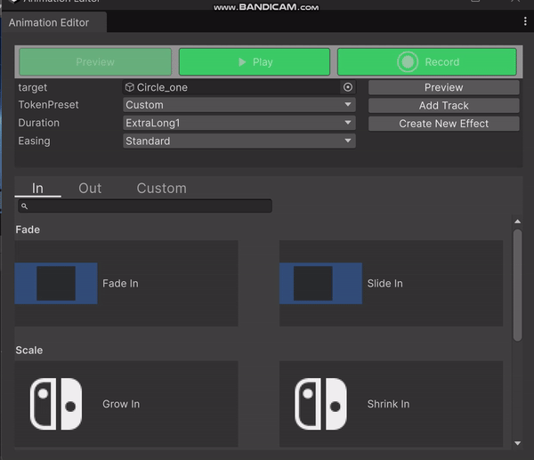

# Tween Timeline Home Page

Status: FrameWork

# Tween TimeLine

Tween TimeLine is an animation design tool for Unity that allows you to easily create UI animations without the need for coding. With the Timeline feature, you can organize and sequence complex animations, while the Tween Action functionality makes it more intuitive to add tween animations and control animated properties. Additionally, the reusable Tween Action Collection helps effectively avoid repetitive work, making animation creation faster and more efficient.

Tween TimeLine 是一款用于 Unity 的动画设计工具，可以让你轻松创建无需代码的 UI 动画。通过 Timeline 功能，你可以组织和编排复杂的动画，

而 Tween Action 功能则帮助更直观的添加缓动动画和控制动画属性。此外，可复用的 Tween Action Collection可有效避免重复工作，使动画制作更加快捷高效。

支持Straight Ahead Action and Pose to Pose两种不同方式来创建动画，前者我们提供缓动动画来创建快速自然的动画，后者动画师可以创建更个性化的动画。

Additionally, the reusable Tween Action Collection helps effectively avoid repetitive work, making animation creation faster and more efficient.

Fell free to use it ! Welcome to contribute it.




# **🕹️ Demo Preview**

 and [**Recreating Mario Odyssey's Kingdom Select | Mix and Jam**](https://www.youtube.com/watch?v=sCK4u5ol3xw&ab_channel=MixandJam)](https://i.giphy.com/media/v1.Y2lkPTc5MGI3NjExdndsbzh4ZWZjem1yM2J2bm0zdDFydHZkczNpenhvMGtlaWFrdnlzcCZlcD12MV9pbnRlcm5hbF9naWZfYnlfaWQmY3Q9Zw/93ewZDYElCqxmHGYZi/giphy-downsized-large.gif)

The source is from [dating-sim-ui-pac](https://loudeyes.itch.io/dating-sim-ui-pack?download) and [**Recreating Mario Odyssey's Kingdom Select | Mix and Jam**](https://www.youtube.com/watch?v=sCK4u5ol3xw&ab_channel=MixandJam)

# **✨ Features**

- Tween Timeline
    - 实时预览：随着时间线拖拽预览，单个track动画，整个动画组合预览
    - 控制动画属性：可以记录场景变化，来调整动画对象的**图形变化**和**运动变化，以及控制时间和动画曲线。**
        - 直接画关键动作（Pose-to-Pose），如果动效简单，你只需用到一个单一的参数，比如物体的位置或者比例，设置两个关键帧或关键动作，结合缓动函数来实现自然的动效。
        - 逐帧画（Straight ahead，接续动作），如果想要实现的动效比较复杂，那么就需要涉及接续动作，得设置多个参数，逐帧逐帧画。
        
        ---
        
        Custom - Curve  Create Editor
        
    - 编排动画：通过拖拽和分层调整动画组合的层级和优先级
    - 智能分层：关于不同Panel 和Composite 的自动分组，关于进入和退出动画的分层，关于同一个对象同一个属性的分层。
    - 一些快速操作：一键生成对应的退出动画，一键归位
- Tween Action
    - Tween Action Unit: 将动画属性和动画行为从代码可视化，更方便的添加动画到TimeLine
        - 快速预览：不理解这个属性是什么，直接应用到对象预览效果
        - *动画预览：不想一个一个尝试预览，可以查看GIF 动画
    - Prebuilt Tween Action Collection: 精心制作的动画，可以无缝应用到你的目标对象上。
    - Create Tween Action Collection: 现有的预构建动画基础上进行组合，或加入自定义的 Action Unit，创建符合你需求的动画。
    - **Suggested easing and duration pairs：选择合适的缓动函数和持续时间组来更快的实现更合理更一致的动画**
- Animation Converter: 支持你之前项目的Animation Clip， 直接加入到TimeLine
- *一些 动画组件：不同的Hover 动画， 不同的Click 动画
- Runtime Tweener : 我们会生成对应的运行动画代码，以及一个“足够智能”的绑定器。

# **🐼 Installation**

### Via Asset Store

Import PrimeTween from [Asset Store](https://assetstore.unity.com/packages/slug/252960).

### Via UPM

### Via Github

## Dependences:

- PrimeTween (Dotween version is on the road map)
- Timeline

## **Enabling Other Extensions (TMPro, Timeline, etc...)**

# **📘 Instruction**

- [Create PlayableDirector and Timeline](https://docs.unity3d.com/Packages/com.unity.timeline@1.8/manual/wf-create-instance.html) （If you know timeline , you can skip this part)
    - Create  a GameObject using a [Playable Director](https://docs.unity3d.com/Packages/com.unity.timeline@1.8/manual/playable-director.html) component.
    - Create a Timeline Asset depend on your animation types
    
    
    
- [Use Unity Timeline window to visually arrange tracks.](https://docs.unity3d.com/Packages/com.unity.timeline@1.8/manual/tl-window.html) There are some additional features we added.
    - Custom Marker
    - Useful track shorcut actions
    - A more visual and convenient method to add animated track
- Open Tween Action Window to quick preview animation
    - Press Ctrl + T on  TimelineWindow or Hierachy Window to Open Tween Action Window
    - Select the game object you want to animate and drag it into Tween Action Window
    - You can see three tabs: In and Out Categroy means prebuilt Animation Collections, the Custom Category contains all animatable tween properties and method depenend on your selected target GameObject
    - Left Click to Select one tween  collection and click the preview btn to preview
    - Right Click to select other tween collection to composite your custom collection
- Create Straight Ahead Action
    - Add Animation Track via Tween Action Window
        - Click the Add Track Btn to Add your select track Into Tracks
        - If you want to add into your wanted place, you can select the group track first and then add the track.
    - Control the timeline clip’s start value and end value
        - you can directly input the new value
        - or you can use the record button to record dynamic changes like Animation.
        - when you append with a new track, we will automatilcally set the start value next to the previous one’s end value. The other button - reset button do these reset things
- Create Pose to Pose Animation
    - Add Animation Track via recording animation directly
        - record animation directly to a Timeline instance. Please see the [record flow on Unity Website](https://docs.unity3d.com/Packages/com.unity.timeline@1.8/manual/wf-record-anim.html).
        - select the animation track and right click →CustomActions→TweenConvertAnimationTrackAction to convert animation to tracks
- Control the timeline clip’s time and easing
    - try combine with different easing token set and different time
    - you can also create your own curve instead of provided presets
- Preview Animation
    - Press the play button of TimelineWindow to play the whole animation
        - But there is a problem TimelineWindow always skip the last frame
        https://discussions.unity.com/t/animation-events-on-last-frame-arent-fired-in-timeline-when-its-the-last-frame-of-the-timeline/768636/3
    - Press the play button of TweenActionWindow to play the animation completely.
    - [Enable the **Play Range** toggle to continuously loop playback within a specific range](Enable the Play Range toggle to continuously loop playback within a specific range)
    - 🤔Select an Timeline Track (usually a group track) to play a slot animation
    - Press the play button of Inspector to preview single animation
- Organize Different TimeLineTracks
    - try the subTimeline when you want to composite and reusable other template, or just use it as a placeholder, for example  to preview scene transitions.
- Convert exsited Animatin Clip
    - Select the animation track and right lick→CustomActions/ TweenConvertAnimations to convert animation. Or  use the shortcut (Shift+H)
    - But you  can still keep it in timeline , we will convert it when GenRuntimeCode.
        - But it’s not recommend to do that since the animation can consits of many animated properties which is not visualized in timeline window
- Add Custom Makers to your track.
    - It’s a placeholder tool for some properties don’t support animated which usually is a type of bool, string. For exmaple .Image.Sprite, GameObject.Enable.
    - if you only want to mark state. Try Empty Track. For exmaple, set one image to disable when animation start.
- Generate Runtime Code: Please  select Tools/Cr7Sund/GeneTweenRuntimeCode.
    - And you will find two generated file  [GenerateTween.cs](https://github.com/liuxinjia/TweenTimeline/blob/473f87f87e734fb758e756c4c51271759a10f4a1/Sample/RunTime/CodeGens/GenerateTween.cs) and [ITweenBindingExtension.cs](https://github.com/liuxinjia/TweenTimeline/blob/d8b982fb17153b9e5ee2835a01ee564b154f4953/Sample/RunTime/CodeGens/ITweenBindingExtension.cs). Please see [this for the use](https://www.notion.so/Tween-Timeline-Home-Page-11d7440b69108091a700fc1f238036f9?pvs=21) of this.
- RunTime Use (Sample Project)
    - Panel transition: you can attach a panel with panel binder. And select the in and out panel transition
    - Composite transition: you can attach a gameobect with composite binder. And select the in and out composite transition
    - Animation Component:you can  attach a animation componnet with the UI Comonent. For example,you can use  HoverBinder to respond the PointerEnterEvent .

# Customazation -Develpers

# Customazation -Artist

### Custom Tween Collection

# Reusable Work

# **🔍 API Reference**

Use the api from GenerateTween directly:

```csharp
GenerateTween.HomePanel_InTween(bindig);
```

Invoke api with string key from GenerateTween:

```csharp
((ITweenBinding)binder).Play("HomePanel_InTween");
```

You need to define some data to be binded. We define an interface to bind like this:

```csharp
    public interface ITweenBinding
    {
        /// <summary>
        /// Gets the tween bound object.
        /// </summary>
        /// <typeparam name="T">The type of the bound object.</typeparam>
        /// <param name="name">The name of the bound object.</param>
        /// <returns>Returns the bound object of the specified type.</returns>
        T GetBindObj<T>(string name) where T : class;

        /// <summary>
        /// Gets the easing effect.
        /// </summary>
        /// <param name="easeName">The name of the easing effect.</param>
        /// <returns>Returns the corresponding easing effect.</returns>
        PrimeTween.Easing GetEasing(string easeName);

        /// <summary>
        /// Plays an audio clip.
        /// </summary>
        /// <param name="audioSource">The audio source.</param>
        /// <param name="clipName">The name of the audio clip.</param>
        /// <param name="clipTime">The starting time to play the clip.</param>
        void PlayAudioClip(AudioSource audioSource, string clipName, float clipTime);

        /// <summary>
        /// Sets the sprite image.
        /// </summary>
        /// <param name="image">The image component to set.</param>
        /// <param name="sprite">The name of the sprite to set.</param>
        void SetSprite(Image image, string sprite);
    }
```

You can see the the exmaple implementation of  ITweenBinding in Sample

# **📖 Examples**

请import sample

- implemenation of ITweenBinding, PanelBinder, CompositeBinder, ComponentBinder
- UI Animated Component: HoverAdapter

# **📃 Note**

- 关于设计动画的一些思考
- About Covert Animation

# 👽 Tips

<aside>
💡

👻👻 To  organized the assets, it’s highly recommend to divide different folders for different types. For example

</aside>

<aside>
💡

Recommend to create only one playable director outmost in the hierarchy. We can change different timeline asset to preview and animate differnt targets.

</aside>

# ❓ Q&A

# **Want to contribute?**

**Please follow these steps to get your work merged in.**

1. Clone the repo and make a new branch: `$ git checkout https://github.com/Juce-Assets/Juce-TweenPlayer/tree/develop -b [name_of_new_branch]`.
2. Add a feature, fix a bug, or refactor some code :)
3. Update `README.md` contributors, if necessary.
4. Open a Pull Request with a comprehensive description of changes.

# **Support**

Join the discussion on [Unity Forum](https://forum.unity.com/threads/1479609/).

Please submit bug reports [here](https://github.com/KyryloKuzyk/PrimeTween/issues).

Submit your questions and feature requests [here](https://github.com/KyryloKuzyk/PrimeTween/discussions).

If you want to contact me privately, please drop me an email: [kuzykkirill@gmail.com](mailto:kuzykkirill@gmail.com)

# **📝 License**