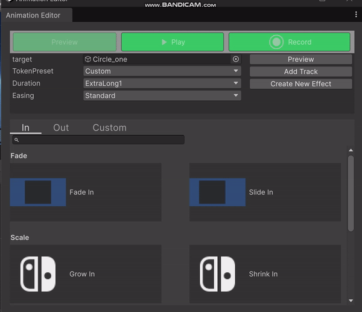
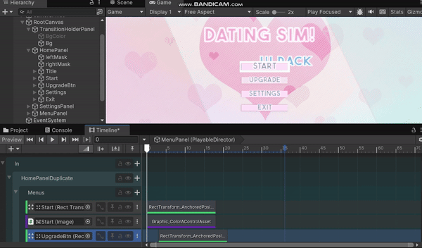
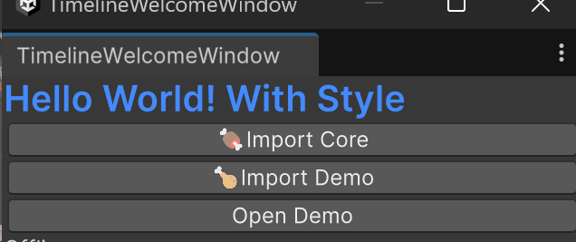

# Tween Timeline Home Page

Status: FrameWork

# Tween TimeLine

---

**TweenTimeline** is a powerful animation design tool for Unity that enables you to visually create, organize, and manage animations with no coding required. The intuitive and familiar **Timeline** window allows you to seamlessly sequence animations, making it easy to build complex transitions and effects.

With **TweenTimeline**, adding and editing animations is both straightforward and fast. The tool supports both **Straight Ahead Action** for smooth, natural motion, and **Pose to Pose** for personalized, keyframe-based animation.

Additionally, **tween collections** and **tween components** enhance asset reuse across projects, promoting a more efficient workflow.

Feel free to use it and contribute to its development!





# **🕹️ Demo Preview**

 and [**Recreating Mario Odyssey's Kingdom Select | Mix and Jam**](https://www.youtube.com/watch?v=sCK4u5ol3xw&ab_channel=MixandJam)](https://i.giphy.com/media/v1.Y2lkPTc5MGI3NjExdndsbzh4ZWZjem1yM2J2bm0zdDFydHZkczNpenhvMGtlaWFrdnlzcCZlcD12MV9pbnRlcm5hbF9naWZfYnlfaWQmY3Q9Zw/93ewZDYElCqxmHGYZi/giphy-downsized-large.gif)

The source is from [dating-sim-ui-pac](https://loudeyes.itch.io/dating-sim-ui-pack?download) and [**Recreating Mario Odyssey's Kingdom Select | Mix and Jam**](https://www.youtube.com/watch?v=sCK4u5ol3xw&ab_channel=MixandJam)

# ✨ Features

## Tween Timeline

---

- **Real-time Preview**: Use buttons to play/stop animations or drag the timeline cursor for real-time scrubbing and feedback.
    - **Individual Clip Preview**: Play single clips in isolation for detailed adjustments.
    - **Individual Track Group Preview**: Play the select group you want to focus
    - **Full Timeline Preview**: See the entire animation sequence to check transitions and overall flow..
- **Control Animation Properties**: Record scene changes to adjust both **visual** and **motion properties**, including timing and animation curves.
    - **Pose-to-Pose (Tween Animation)**: Create smooth animations for simple effects, such as changing an object’s position or scale. This method allows you to set just two keyframes (start and  end ) with easing functions, resulting in fluid transitions ideal for animations.
    - **Straight Ahead Action (Frame-by-Frame Animation)**: For more complex effects, you can fine-tune multiple parameters by creating frame-by-frame animations. This approach provides detailed control and enables expressive, non-linear movements, making it ideal for handcrafted or intricate actions.
- **Animation Layering**: Organize and layer animations by dragging and adjusting their priority on the timeline.
- **Intelligent Layering**: Automatically group animations by panels or composites. Separate layers for enter and exit animations, and manage layers for the same property on a single object.
- **Useful Track Actions**: Quickly generate exit animations based on the entry position or reset objects to their original state with a single click.

## Tween Action

---

- **Tween Action Units**: Visualize animation properties and behaviors directly, making it easier to add animations to the timeline.
    - **Quick Preview**: Apply properties to objects instantly to preview the effect in real-time.
    - **Animation Preview**: View prebuilt GIFs of animations to quickly understand how they will behave without trial and error.
- **Prebuilt Tween Action Collection**: A collection of ready-made animations that can be applied directly to your objects with minimal adjustment.
- **Create Custom Tween Actions**: Combine existing prebuilt actions with custom **Action Units** to craft animations tailored to your specific needs.
- **Suggested Easing and Duration Pairs**: Speed up your workflow by selecting Material Motion style easing functions and duration pairs for consistent, professional-looking animations.

### Animation Converter

- **Import Animation Clips**: Seamlessly import Animation Clips from previous projects and add them to the timeline for reuse and adaptation.

### Runtime Tweener

- **Auto-generated Runtime Code**: Automatically create the code to run your animations from timeline assets, featuring an intelligent binder for easy object linking.
- Panel Binder and Composite Binder: do panel  and composite transition
- **Compontent Binder Adapter**:  Some prebuilt binder that can be easily applied to your UI elements for immediate interactivity.

### Animation Components (Samples): Preview in Editor and Run at Runtime

- **Panel Binder and Composite Binder**: Manage panel and composite transitions.
- **Component Binder Adapter**: Prebuilt binders that can be easily applied to your UI elements for instant interactivity.

# 📘 Getting Started Guide

## **Installation**

### Install Via Asset Store

1. Download the package from [Unity Asset Store](https://assetstore.unity.com/packages/slug/299475)
2. After downloading, you will see the Welcome window below
3. Click the "Import Core" button to automatically import the package and all dependencies
4. (Optional) Click "Import Demo" and open the demo scene to explore sample implementations



### Via OpenUPM

Step 1: Install PrimeTween

First ensure PrimeTween is installed in your project, as it's a required dependency.

Step 2: Add Package

Add the package to your project using OpenUPM CLI:

```bash
openupm add com.cr7sund.tweentimeline
```

### Dependences:

- [PrimeTween](https://github.com/KyryloKuzyk/PrimeTween)
- Unity.[Timeline](https://docs.unity3d.com/Packages/com.unity.timeline@1.8/manual/index.html)

## Initial Setup

### 1. [Create Timeline Components](https://docs.unity3d.com/Packages/com.unity.timeline@1.8/manual/wf-create-instance.html)

- Create a GameObject with a [PlayableDirector](https://docs.unity3d.com/Packages/com.unity.timeline@1.8/manual/playable-director.html) component
- Create a Timeline Asset based on your animation requirements

## Core Features

### 1. Tween Action Window


**Opening the Window**

- Press `Ctrl + T` in Timeline or Hierarchy Window
- Select and drag your target GameObject into the window

**Window Layout**

- **In/Out Tabs**: Browse prebuilt animation collections
- **Custom Tab**: Access all animatable tween properties for selected GameObject
- **Tween Action** :
    - Left Click preview button to test selected action
    - Right-click to
        - Combine multiple actions by right-clicking additional selections, see more at custom part

**Preview Action**
- Select different action to preview
- Select [different easing pairs](https://m3.material.io/styles/motion/easing-and-duration/applying-easing-and-duration#27a05b8b-02b1-4695-a7e4-70797f205222) to preivew different time and easing combinations
- **Value Configuration:** Adjust start value and end value
    - **Default Mode**: Direct transition from start value to end value
    - **Relative Mode**: Movement relative to current position
        - Example: If current position is (100,100) and target is (50,50), object moves +50 units
    - **Additive Mode**: Apply delta changes to current position
        - Example: If delta is (10,10), adds to current position each update

### 2. Creating Animations

**Straight Ahead Animation**


1. Add Animation Track:
    - Click "Add Track" in Tween Action Window
        - To add to your desired location, first select the group track, then proceed to add the new track.
2. Configure Values:
    - Manually input start/end values
    - Use record button for dynamic changes
        - Auto-move to you start/end values
    - Reset button available for value restoration
        - Auto-continue from previous track's end value (append mode)


**Pose to Pose Animation**

1. Direct Recording:
    - Follow Unity's [standard recording workflow](https://docs.unity3d.com/Packages/com.unity.timeline@1.8/manual/wf-record-anim.html)
    - Convert to tween tracks: Right-click animation track → Custom Actions → Tween Convert Animation Track
2. Convert existed Animation 
    1. Add your animation track with existed animation clip
    2.  Convert to tween tracks: Right-click animation track → Custom Actions → Tween Convert Animation Track

### 3. Animation Control

**Timing & Easing**

- Combine different easing tokens and timing
- Create custom curves for unique effects

**Preview Options**


- Timeline Window
    - Play Toggle: Full animation preview (Note: may skip last frame)
    - [Enable the **Play Range** toggle to continuously loop playback within a specific range](Enable the Play Range toggle to continuously loop playback within a specific range)
    - However  there is a problem
    - https://discussions.unity.com/t/animation-events-on-last-frame-arent-fired-in-timeline-when-its-the-last-frame-of-the-timeline/768636/3
- Tween Action Window Smater Play Button
    - Complete animation playback
    - Select Timeline Track First to play selected track animation
- Inspector preview for single clip animations

### 4. Advanced Features

**Track Organization**

- Use sub-timelines for:
    - Reusable animation templates
    - Scene transition previews
    - Modular animation composition

**Converting Existing Animations**

- Select animation track → Right-click → Custom Actions → Tween Convert Animations
- Shortcut: `Shift + H`
- Option to defer conversion until runtime code generation

**Custom Markers**

- Perfect for non-animated properties (bool, string)
- Useful for state marking with Empty Track
- Example:
    - Toggle GameObject visibility during animation
    - Switch Image sprite at differnt time

### 5. Runtime Implementation

**Code Generation**

1. Select `Tools/Cr7Sund/GeneTweenRuntimeCode`
2. Generated files:
    - `GenerateTween.cs`
    - `ITweenBindingExtension.cs`

> Note: For more detailed examples and API documentation, [see the api below](https://www.notion.so/Tween-Timeline-Home-Page-11d7440b69108091a700fc1f238036f9?pvs=21).
> 

**Runtime Components (Sample)**

- **Panel Binder**: Handle panel transitions
- **Composite Binder**: Manage composite transitions
- **Animation Components**: Attach to UI elements to respond to various events (e.g., HoverBinder for pointer events)

## Tips & Best Practices

- Keep animation tracks organized in logical groups
- Use markers for chagne state
    - Try Empty Track if there exist no animation. For exmaple, set one image to disable when animation start.
- Test a whole transitions with different thoroughly in one itmeline asset

# **🔍 API Reference**

Use the api from GenerateTween directly:

```csharp
GenerateTween.HomePanel_InTween(bindig);
```

Invoke api with string key from GenerateTween:

```csharp
((ITweenBinding)binder).Play("HomePanel_InTween");
```

You need to define some data to be binded. We define an interface to bind like this:

```csharp
    public interface ITweenBinding
    {
        /// <summary>
        /// Gets the tween bound object.
        /// </summary>
        /// <typeparam name="T">The type of the bound object.</typeparam>
        /// <param name="name">The name of the bound object.</param>
        /// <returns>Returns the bound object of the specified type.</returns>
        T GetBindObj<T>(string name) where T : class;

        /// <summary>
        /// Gets the easing effect.
        /// </summary>
        /// <param name="easeName">The name of the easing effect.</param>
        /// <returns>Returns the corresponding easing effect.</returns>
        PrimeTween.Easing GetEasing(string easeName);

        /// <summary>
        /// Plays an audio clip.
        /// </summary>
        /// <param name="audioSource">The audio source.</param>
        /// <param name="clipName">The name of the audio clip.</param>
        /// <param name="clipTime">The starting time to play the clip.</param>
        void PlayAudioClip(AudioSource audioSource, string clipName, float clipTime);

        /// <summary>
        /// Sets the sprite image.
        /// </summary>
        /// <param name="image">The image component to set.</param>
        /// <param name="sprite">The name of the sprite to set.</param>
        void SetSprite(Image image, string sprite);
    }
```

You can find an example implementation of **ITweenBinding** in the Demo.

# **📃 Note**

[Mateial Motion Design](https://www.notion.so/Mateial-Motion-Design-56985849391146faa0481ca5fe2c34ec?pvs=21)

[Animation Guide Desgin](https://www.notion.so/Animation-Guide-Desgin-1237440b691080a88463d61a1c80c5c9?pvs=21)

[Customazation](https://www.notion.so/Customazation-1237440b691080b5ad86e04652b9503a?pvs=21)

[Component Kit](https://www.notion.so/Component-Kit-1237440b6910804f86a1ed4d1e2b726a?pvs=21)

# ❓ Q&A

1. Why use PrimeTween instead Of Dotween?
    
    PrimeTween has 0 runtime memory allocations
    
2. How does the tool convert animations?
We simplify different keyframes to just two keyframes: the start and end keyframes. The intermediate keyframes are handled by evaluating the animation curve. Therefore, it's essential to ensure that we have the appropriate curve in place.
Below is an example comparing the animation clip with our converted track.
    
    
    
    
    
    **Another issue we encounter: Object KeyFrames.**
    
    We need to convert certain non-animatable properties, specifically unsupported types such as string, bool, and (~~Sprite~~). We are attempting to use markers to handle these cases.
    
    
    
    and we use reflection to get all not animatale Field Types And Properties.
    
    
    
    
    
    
    
    ```csharp
               .Group(Sequence.Create()
                    .InsertCallback(0.3166667f, binding.GetBindObj<UnityEngine.RectTransform>("Bg"), (target) => { target.gameObject.SetActive(false);})
                    .InsertCallback(1.333333f, binding.GetBindObj<UnityEngine.RectTransform>("Bg"), (target) => { target.gameObject.SetActive(true);})
               )
    ```
    
    ```csharp
               .Group(Sequence.Create()
                    .InsertCallback(0.3166667f, binding.GetBindObj<UnityEngine.UI.Image>("NextBtn"), (target) => { binding.SetSprite(target, "clock_blue");})
                    .InsertCallback(0.8166667f, binding.GetBindObj<UnityEngine.UI.Image>("NextBtn"), (target) => { binding.SetSprite(target, "BlueBtn");})
                    .InsertCallback(1.333333f, binding.GetBindObj<UnityEngine.UI.Image>("NextBtn"), (target) => { binding.SetSprite(target, "BlueBtn");})
               )
               .Group(Sequence.Create()
                    .InsertCallback(0.3166667f, binding.GetBindObj<UnityEngine.UI.Image>("backArrow"), (target) => { binding.SetSprite(target, "BackArrow");})
                    .InsertCallback(1.333333f, binding.GetBindObj<UnityEngine.UI.Image>("backArrow"), (target) => { binding.SetSprite(target, "blueprint_rare");})
               )             
    ```
    
    However, there are some issues we cannot resolve or practices to avoid:
    
    关于Curve 不一致
    
    1. Use alternative methods for looping.
        
        
        
    2. Inconsistencies with the curve:The last frame has a different duration from the clip (usually occurs after deleting the last frame).
    
        
        
        
        
        
    
    1. Why one track can only control one proerty?
        
        我们发现每个track 只控制一个属性，对于整体来说更加直观，且随着动画的不断增加，不同track 之间也能职能明确。同时通过调研，我们发现大部分工具实现也是如此。
        
        
        
        
        
        
        
    

# **Want to contribute?**

**Please follow these steps to get your work merged in.**

1. Clone the repo and make a new branch:
2. Add a feature, fix a bug, or refactor some code :)
    1. If you want to submit a new tween collection set or Animated Components
    2. Please subit it as sample and update package`.json`
3. Update `README.md` contributors, if necessary.
4. Open a Pull Request with a comprehensive description of changes.

# **📝 License**

[MIT](https://choosealicense.com/licenses/mit/)